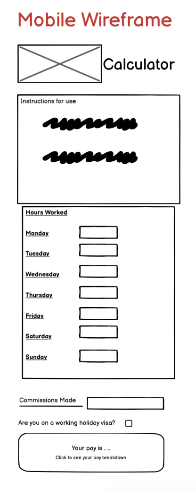
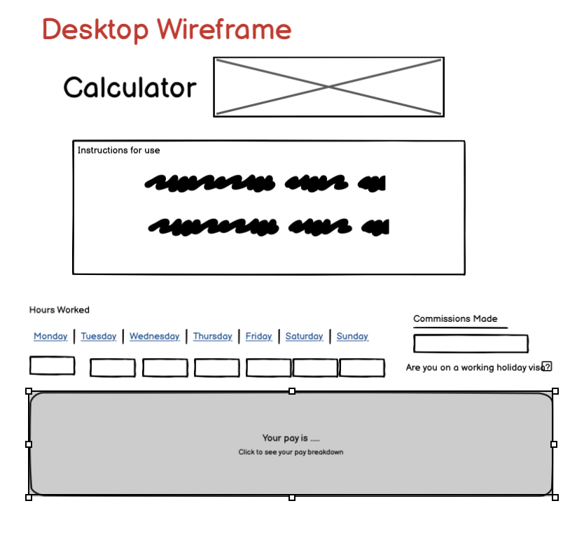
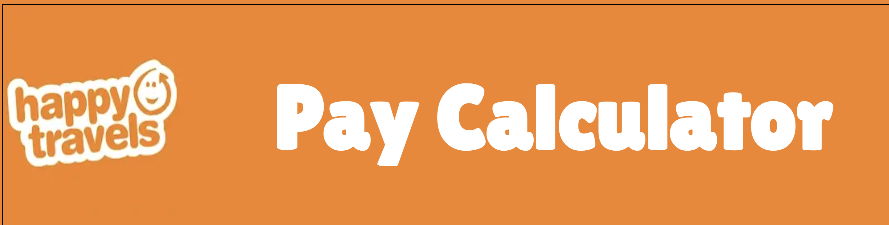
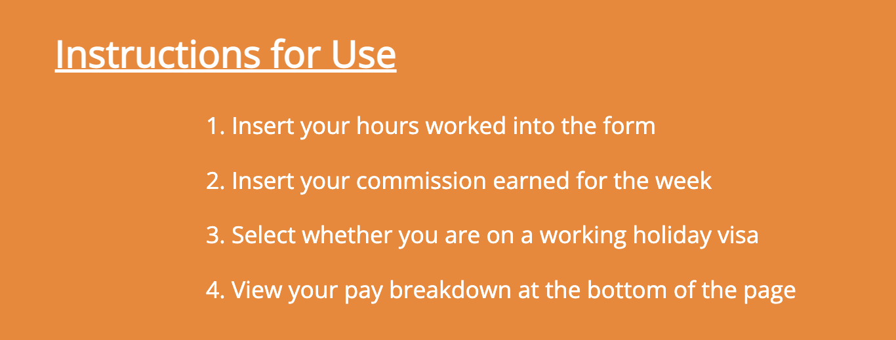
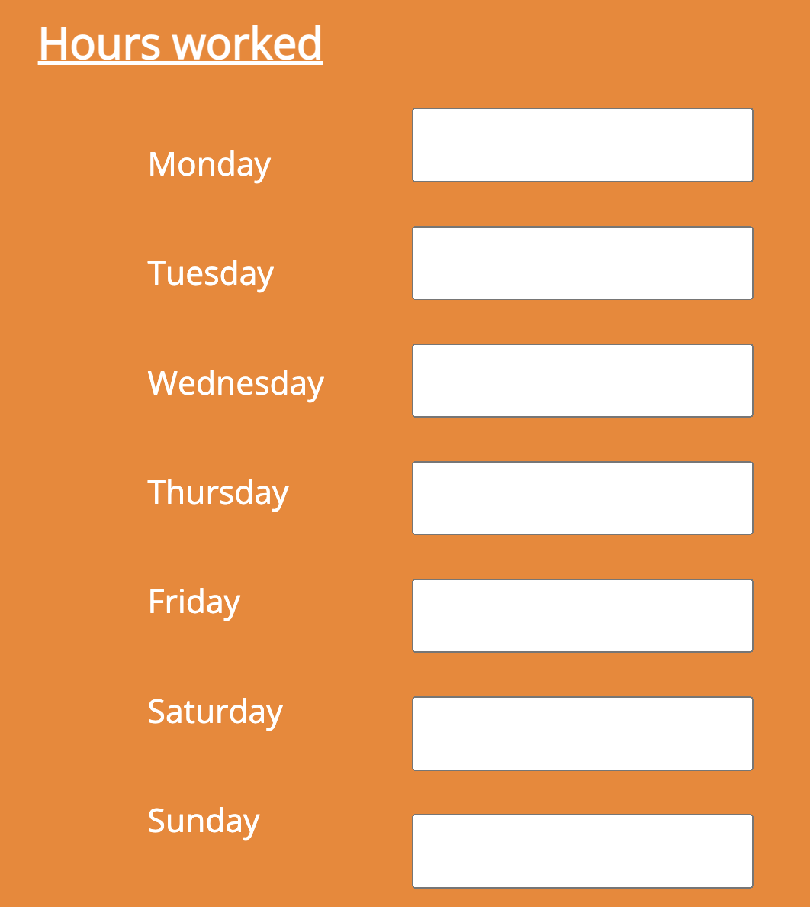
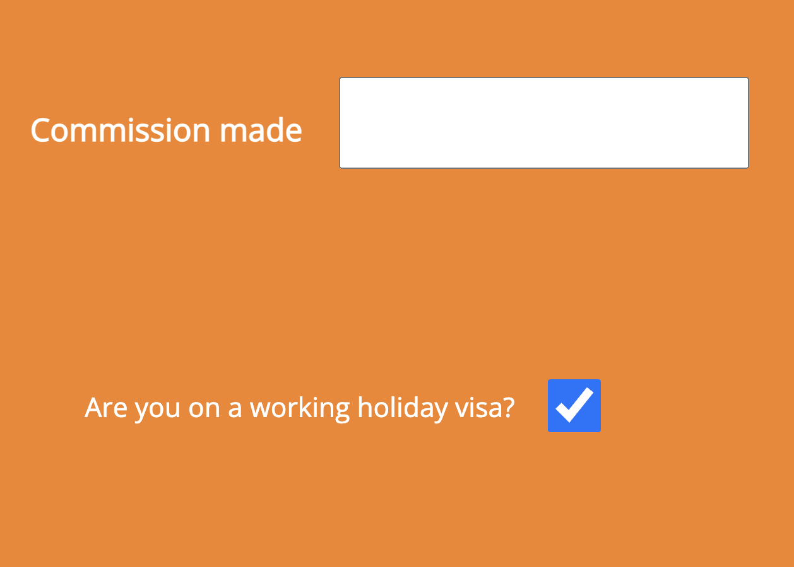
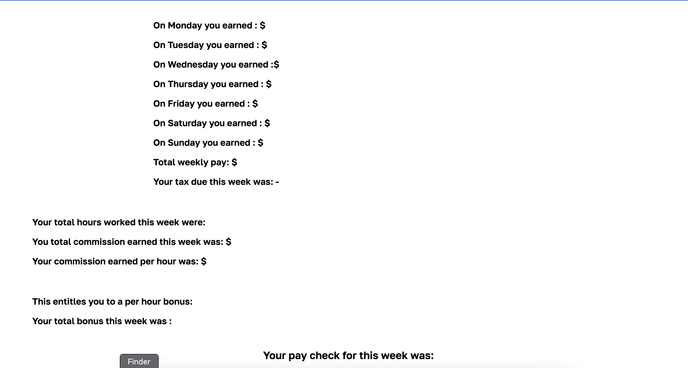

# Portfolio2_CPH-calculator

The CPH calculator is an interactive online tool to help employees of HappyTravels to calculate their Commission Per Hour. This tool will be used to save employees time when calculating the Commission bonus structures and also allow employees to double check that their paychecks are correct each week. This is a very simple tool that works by accepting user inputs of hours worked and total commission earned. The tool also factors in the 15% tax bracket for working holiday makers or the 35% tax bracket for local residents. The tool then outputs total pay, pay per hour, commisson per hour, commission bonus and tax paid to allow users to understand their precise pay breakdown.

[Live Website](https://d-lynch95.github.io/Portfolio2_CPH-calculator/)

## User Goals and Stories

### User goals
- As a user I want to
  - easily and intuitively navigate throughout the website
  - browse the website naturally and with ease
  - understand how to use the website using simple instructions
  - be able to view the website and read all information on all screen sizes
  - easily input my information and view my pay 
  - be able to reach out to the company for more information

### Business owner goals
- As the website business owner I want to 
  - provide a tool for employees to see their commission bonus
  - provide a way for employees to double check their pay is correct
  - provide a tool to free up employee time and increase efficiency
  - provide a way for employees to view current bonus status 
  - motivate employees to make more sales by viewing cph bonuses

### User Stories

#### As a user
  - As a user I want to visit the website to calculate my pay
  - As a user I want to easily understand how to use the website
  - As a user I want to input my information with ease
  - As a user I want to view my pay breakdown with ease
  - As a user I want to use the tool to ensure my weekly pay is correct
  - As a user I want to use the tool to calculate money needed to reach the next bonus 

#### As a website business owner
- As a site owner I want to provide a tool to allow employees to calcualate commission bonus
- As a site owner I want to excite users and peak their interest
- As a site owner I want to allow for a good user experience
- As a site owner I want to allow the customer to easily navigate the website without issues
- As a site owner I want to provide an error 404 page with a link home incase of any issues
- As a site owner I want to motivate employees to increase sales by allowing them to see commission structure
- As a site owner I want to increase transparency of pay between management and staff
- As a site owner I want to allow employees to independently calculate their wages

#### As a new user
- As a new user I want to navigate the page intuitively and with ease
- As a new user I want to understand the page purpose upon first viewing
- As a new user I want to have the instructions explained clearly on how to use the tool
- As a new user I want to easily input my information
- As a new user I want to view output of calculations with ease
- As a new user I want to have view my total pay package
- As a new user I want to have my pay breakdown explained to me
- As a new user I want to view the amount of taxation due
- As a new user I want to view my total bonus paid each week
- As a new user I want to enjoy the experience and return to use the tool each week

## Design

### Font
The design of this website is based off a very minimalist style. The purpose of this website is to provide a tool for users to calculate their weekly pay with ease. The design of the website focuses on usability and ease of understanding instead of complex design. The orange colour scheme is in-line with the HappyTravels brand and the main page title is written in a Lillita one font to reflect the fun and playful font of the HappyTravels logo. The main body is written in an Open Sans font to allow for accessibility and ease of reading. The font for the main body is white to allow for contrast and ease of reading. This font colour is also in line with brand guidelines.

### Structure

This website has a simple single page design. This format was easiest and allows the user to understand the information input process and use the tool instantaneously. The page also has a 404 error page to deal with any errors and allow the users to return to the main page.

### Wireframe

The wireframes were developed in a mobile first environment. The original wireframe design has had some minor alterations during production but has mostly remained true to the design.

##### Main Page

## Technologies used
- HTML
  - The main body of the website was created using HTML
- CSS
  - The website was styled using a linked CSS file
- GitHub
  - The website is hosted on GitHub
- GitPod
  - The website was developed on GitPod
- Git 
  - used to commit and push code during development
- Convertio.co
  - [This](https://convertio.co/) site was used to convert jpg and png files to webp files
- Tinypng
  - [TinyPNG](https://tinypng.com/) was used to reduce file sizes across the site
- Favicon.io 
  - This site was used to create the [favicon](https://favicon.io/) files
- Balsamiq
  - The original wireframe idea was created using [Balsamiq](https://balsamiq.com/wireframes/desktop/#)

## Features 

### Existing Features

- __Header__

  - This section clearly shows the  company logo allowing users to instantly recognise the brand. The header also includes a title clearly displaying that the website is a "Pay calculator"

- __Instructions section__

  - The instuctions section includes four very simple steps for users to follow in order to use the tool.
  - This section is very easy to follow and allows users to use the tool with minimal effort on their end.

- __Hours worked section__

  - The hours worked section contains the names of the weekdays and corresponding input boxes.
  - The input boxes take number inputs and have a maximum of 8 hours. This is due to casual contract workers not being allowed to work more than 8 hours per day.
  - The hours are stepped in 0.5 intervals as this is how pay is calculated.

- __Commission and Tax section__

  - This section will allow the user to input the total amount of commission earned.
  - This figure will then be taken into multiple formulas and used to calculate commission per hour and the commission bonuses.
  - The tax section contains a simple checkbox. As most employees are on working holiday visas the box is automatically checked
  - The information gathered at this section will help to decide whether to base employees tax calculations off a 15% or a 35% tax bracket.

- __Pay breakdown section__

  - This section allows the user to view their over all pay and the precise breakdown of their pay.
  - This section shows how much the user made for working each day. Weekday pay is 29.23 per hour, Saturday pay is 35.07 and Sunday pay is 40.92 per hour. The user can then see the total pay per week.
  - The next section shows the users tax paid per week. This is calculated using a formula depending whether a user is on a working holiday visa or not.
  - The next section shows the user their total hours worked. User can also see their total commission made for the company.
  - The commission per hour section is then broken down by dividing commission by number of hours worked.
  - The bonus is calculated by using the formula that includes the different cph bands.
  - This bonus is then multiplied by the hours worked to calculate total bonus.
  - The total bonus is calculated by adding total weekly wage, deducting tax paid and adding the bonus.

  

 
- __Error 404 Page__
    - This page will help the user navigate back to the home page if there is any typo or broken links in the site. This page will contain a clickable link to return home.

### Features Left to Implement

- I would like to add a hamburger menu for mobile and tablet devices for this site when I have the requisite knowledge.

- I would like to format the server in the future to accept form submissions and allow the site owner to view users form submissions.

## Testing 

### BUGS
 - I encountered several bugs while creating this project.

 - There were issues with the icons and social media links located in the footer. I struggled to correctly format links to the external sites while creating links in the icons.
  This was corrected by adding "HTTPS://" to the front of the href aswell aswell as adding the target="_blank" attribute.
  I was also having issues with the icons duplicating themselves with one icon having an active link and the second icon not having a link. This was due to an issue with missing closing tags on our <i> element and was quickly corrected after some testing.

 - There was an issue when creating the hero image for the landing page. When adding the hero image the nav bar would disappear. This issue was temporarily fixed by removing the 'position:fixed;' attribute. We still wanted the Nav bar to be fixed so we corrected this by setting the z-index to 1.

 - The attractions section on the index page caused a lot of issues as this was the first time working with flexbox. The [Academind](https://www.youtube.com/watch?v=RSIclWvNTdQ) youtube tutorial on CSS V Flexbox was very helpful to resolve these issues.

 - When uploading the photos for the attractions page I spent a lot of time struggling with the format of one image. I could not figure out why the css was not working on this one image but had formatted all of the other images correctly. In the end I gave up and opted to change the image. When I changed the image to one of a similar theme the image responded to the css immediately. In hindsight I think the issue may be that the original image was in portrait mode and all of the other images were in landscape.

 - While creating the hamburger menu I struggled a lot with a certain bug. I was able to format the menu but could not manage to get the menu to open. I struggled with this for a long time until an online blog I was reading suggested moving the script tag to after where the element is declared. I moved the script tag to the bottom of the html page and the hamburger menu began to work. 

 - The hamburger menu was creating an issue that when the site is viewed on mobile or tablet sized screens (< 768px) the hamburger menu appears at the left side of the screen as an opaque rectangular box. When the hamburger menu is clicked this menu slides out from the left to fill the screen. As this functionality was borrowed from an online tutorial I have struggled to fix this bug as I do not have the required Javascript knowledge yet. Instead I opted to remove the hamburger menu in favour of a different style of menu for mobile and tablet devices.

 - I tried to create a pair of buttons on the index page with class to action of Find Out More and Contact Us. I nested an anchor tag within the button but this did not pass html validation. I searched on [stack overflow](https://stackoverflow.com/questions/6393827/can-i-nest-a-button-element-inside-an-a-using-html5) and found a solution. In the end I opted to keep the a tag and style it with CSS to resemble a button.

  - Once the site was deployed I had issues with viewing the hero images on each page. This was due to the use of absolute file paths. Once we changed them to relative file paths the images loaded without issues.

  - There was an issue with the confirmation.html page. This page was supposed to be the destination for form submission. After receiving help from Sean Young on slack I was told that we do not yet have the requisite knowledge to format the server to accept form submissions. I have added a submission confirmation page but do not have the server formatted to accept form submissions.
  
  - The footer has underlines in the spaces between the social media icons. User inc21 on slack pointed out that these could be removed by adding a text-decoration:none to the css. This removed the issues with the underline.
  
### User Testing

The site was tested on chrome, safari and opera browsers on desktop without any issues. The site was tested on desktop, tablet and mobile using chrome developer tools. The actual tablet testing was done on an ipad. The mobile testing was done on an iphone 12 using the safari browser and also tested on android devices OnePlus 7 and OnePlus Nord CE on chrome browsers. The site was also tested on a samsung phone using the opera browser. None of the tablet or mobile devices presented any issues.

### Accessibility

- Home page

### Validator Testing 

- HTML
  - No errors were returned when passing through the official [W3C validator](https://validator.w3.org/nu/?showsource=yes&doc=https%3A%2F%2Fd-lynch95.github.io%2FPortfolio-1-GreatOceanRoadsters%2Findex.html)
  

  
  -
- CSS
  - No errors were found when passing through the official [Jigsaw validator](https://jigsaw.w3.org/css-validator/validator?uri=https%3A%2F%2Fd-lynch95.github.io%2FPortfolio-1-GreatOceanRoadsters%2Findex.html&profile=css3svg&usermedium=all&warning=1&vextwarning=&lang=en#warnings)

### Manual Testing

#### Functional Testing 

We tested the links in the navigation section of the header for all pages on multiple devices.

| Navigation link  | Page to load  |
| -----------      | -----------   |
| Logo             | index.html    |
| Home             | index.html    |
| Itinerary        | itinerary.html|
| Gallery          | gallery.html  |
| Contact Us       | contact.html  |

All of these links worked as expected and lead to the correct pages.

We tested the two buttons on the index page. The "Find out more" button links to the itinerary.html page in a new tab. This worked without any issues.
The Contact Us button takes us to contactus.html in a new tab. This did not present any issues.

When the FAQ section questions are clicked the answer should appear beneath in a details and summary section. We tested this for all of the questions on multiple browsers on desktop, mobile and tablet. All of the questions present the answers when clicked as expected.

We also tested the social media links at the bottom of the page and they all led to the respective social media sites.

On the itinerary page we tested the clickable links in the text. Each attraction when clicked leads to a wikipedia or website entry about the attraction. We tried this on multiple browsers and on mobile devices and the links opened without any issues.

The itinerary page also contains underlined links that connect to the contactus.html page when clicked. These links all work as expected and open the link in the new tab.

We tested the controls of the iframe youtube video on mobile, tablet and laptop. Users have the ability to start and stop the video as needed, increase or decrease volume and view in fullscreen.

The contactus.html page required more indepth manual testing as we had several features that needed to be tested.

- Contact form
  - Expectation : User inputs all information correctly, form is submitted and takes you to the confirmation page.

  - Reality : This worked as expected on mobile, tablet and desktop.

  - Result: pass

  - Expectation: When information is input but a correct email format is not provided this will be flagged and form will not be submitted.

  - Reality: When an incorrect format is input a pop up will appear asking user to input a correct email address. This happened on all devices,

  - Result: pass

- Email us
  - Expectation: When the user clicks the email address a seperate window will open to allow the user to compose an email.

  - Reality: When tested on a macbook, a new 'mail' application will open with the email address autofilled allowing the user to email the company directly.
    When clicked on an android device the gmail app will open with the company email address autofilled allowing for ease of use

  - Result: pass

- Phone Us
  - Expectation: When the phone number is clicked the user will be able to phone the supplied number directly

  - Reality: When the phone number is clicked on a mobile device the phone will autofill the number and allow you to dial. 
    When the phone number is clicked on desktop the connected phone number on google chrome will pop up and give you the option to "Make a call from OnePlus".
    When the phone number is clicked on while using safari the facetime app will open and allow you to call.

  - Result : pass

### Unfixed Bugs
 - There are no current bugs that we're aware of.

## Deployment

- The site was deployed to GitHub pages. The steps to deploy are as follows: 
  - In the GitHub repository, navigate to the Settings tab 
  - From the source section drop-down menu, select the Main Branch
  - Once the main branch has been selected, the page will be automatically refreshed with a detailed ribbon display to indicate the successful deployment. 

The live link can be found here - https://d-lynch95.github.io/Portfolio2_CPH-calculator/

## Credits 

### Content 

- The format and template for the README file was borrowed from the [Code institute](https://codeinstitute.net/ie/)

- The image conversions from jpg to webp were done with [Convertio](https://convertio.co)

- The image compressions were done using [Tinypng](https://tinypng.com)

- The fonts were taken from googlefonts.

- The logo was downloaded from Google images

- The Favicon was made using [Favicon](https://favicon.io/)

### Coding help

- The outline template for the HTML body was provided by the [Code Institiute](https://www.codeinstitute.com)

- A lot of the Javascript coding was done with help from the tutorial pages at [w3schools](https://www.w3schools.com/)

- Adding the Favicon to the website was done using help from [StackOverflow](https://stackoverflow.com/questions/4888377/how-to-add-a-browser-tab-icon-favicon-for-a-website)

 - I also received help from the following slack users for minor bugs or style changes inc21, Tatiana Ruffo, Dave T, Jo_ci and I received a lot of help and advice from my mentor Gareth McGirr and from Paul Thomas our cohort leader.
